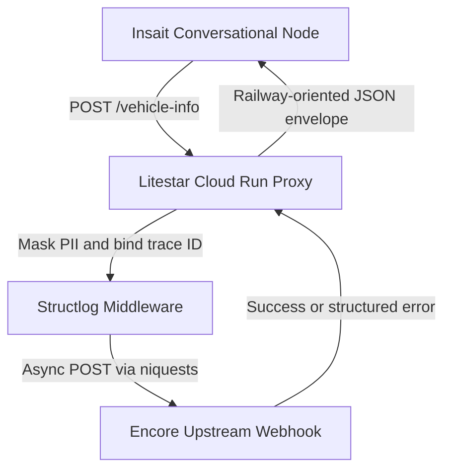

# Planned Architecture and Design Decisions

This document describes the target architecture for the onboarding service.
The repository currently contains a health-check ASGI scaffold; the vehicle
proxy and Insait flow remain planned work.

## 1. Target System Topology


## 2. Planned API Proxy and Anti-Corruption Layer

### Framework

**Litestar** will provide structured controller patterns and Pydantic v2 integration, keeping the proxy boundary explicit and maintainable.

### Runtime

**Granian** is the planned Rust-based ASGI runtime for asynchronous I/O and efficient resource usage on Google Cloud Run.

### HTTP Client

**niquests** is the planned HTTP client for communication with the upstream webhook.

### Resilience

The proxy will implement a generic railway-oriented response envelope:

```text
APIResponse[T]
```

All upstream failures—including `404`, `500`, and timeout responses—will be converted into a typed JSON contract. This will prevent unhandled upstream exceptions from propagating into the Insait conversational graph.

## 3. Planned Observability and Security

Incoming requests will be assigned an `X-Trace-ID`, which will be bound to the structured logging context through `structlog`.

Pydantic validators will apply deterministic PII masking before sensitive data reaches application logs.

### Production Roadmap

At enterprise scale, the proxy can be extended with:

- An LLM-backed schema firewall for redacting unstructured conversational input
- OpenTelemetry instrumentation and export
- Centralized log aggregation and trace analysis
- Additional canonicalization of extracted PII before persistence

## 4. Planned Insait Graph Strategy

### Node Footprint

The conversational flow is intended to remain lightweight, with a six-node architecture mapped to the assignment's five user-facing stages.

### Routing

Deterministic edges will handle hard business conditions such as API success flags and validation results. LLM-based exits will handle flexible conversational interpretation and unstructured user input.

### State Mutability

Conversational loops in the summary and confirmation stages will allow users to revise previously supplied entities—including contact details, vehicle information, and add-ons—without terminating the flow.

## 5. Planned Edge-Case Handling

### Upstream Timeout Handling

A `504 Gateway Timeout` from the Encore webhook will be distinguished from other errors, allowing the Insait graph to route the user to a fallback manual-collection path.

### Schema Rigidity

A strict seven- or eight-character license-plate constraint limits international scalability. The upstream webhook should support ISO-compatible international string formats, with geographic normalization delegated to the semantic layer.

### PII Analytics Gap

Because the planned flow avoids explicit UI forms, entities will be extracted dynamically from natural-language input. A future semantic firewall could normalize extracted PII into canonical schemas before it is persisted or forwarded to downstream systems.