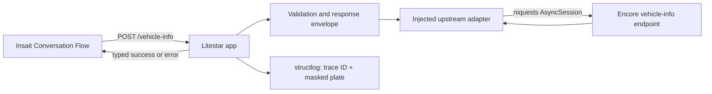

# Planned Architecture and Design Decisions

The repository is a scaffold for the Encore AI car-insurance assignment. The
implementation target is one small vertical slice: a stateless vehicle lookup
proxy plus a documented handoff for the manually built Insait flow.

## System topology



The current code contains only `/health`; all vehicle behavior below is
planned.

## Service contract

### Inbound request

`POST /vehicle-info` accepts JSON with one field:

```json
{"license_plate": "12345678"}
```

The proxy trims surrounding whitespace, canonicalizes the plate to uppercase,
and accepts a non-empty ASCII alphanumeric value within a documented,
defensive maximum length. Invalid input is rejected at the proxy seam and
never reaches the upstream. The service does not assume a country-specific
plate length because the assignment does not define one.

### Response envelope

The public response is a generic Pydantic model:

```text
APIResponse[T] = {
  success: bool,
  data: T | null,
  error_code: str | null,
  message: str | null,
  trace_id: str
}
```

Successful data is the assignment's vehicle shape: `license_plate`,
`manufacturer`, `model`, `year`, and `color`. Error responses are still
structured JSON and use HTTP 200 so the Insait graph can route on
`success`/`error_code` without an unmapped upstream exception. Proxy input
validation may use the framework's normal 4xx handling; upstream and adapter
failures must never escape as an unstructured 5xx.

Initial error codes:

- `INVALID_REQUEST` — proxy validation failed.
- `VEHICLE_NOT_FOUND` — upstream returned not found.
- `UPSTREAM_TIMEOUT` — the bounded request timed out.
- `UPSTREAM_UNAVAILABLE` — connection, transport, or upstream 5xx failure.
- `UPSTREAM_INVALID_RESPONSE` — upstream returned an unusable payload.

The exact upstream status-to-code mapping and user-safe messages are covered
by tests before implementation is considered complete.

## Module seams

- **HTTP controller**: Litestar adapter for `POST /vehicle-info`; resolves
  `UpstreamPort` from `app.state`, reads trace id from observability helpers,
  delegates to the vehicle lookup module.
- **Vehicle lookup module**: orchestrates `UpstreamPort.fetch_vehicle`, maps
  through the response envelope module, and emits PII-safe completion logs.
- **Request schemas**: `VehicleRequest` normalization and validation (ingress).
- **Response envelope module**: `VehicleInfoResponse`, error codes, builders,
  and mapping from `UpstreamOutcome` to the Insait-facing JSON contract.
- **Upstream port**: accepts a validated plate and returns a typed success or
  failure outcome. Wired on `app.state` at composition time.
- **niquests adapter**: owns the `AsyncSession`, URL, JSON encoding, timeout,
  status mapping, and response parsing. Tests replace this adapter at the
  seam; tests do not call the real upstream.
- **Logging middleware**: creates or accepts `X-Trace-ID`, binds it to
  `structlog` context, and clears context after the request. Handlers read
  trace ids via `trace_id_for_request`; they do not mint new ids.

**Invalid license plates:** Pydantic validation on `VehicleRequest` fails at
the Litestar ingress seam with HTTP **4xx** (framework validation body). The
upstream port is not called. `ErrorCode.INVALID_REQUEST` is documented for
envelope routing but is **not** returned on that path today. Insait should
pre-validate plates and/or branch on HTTP client errors; upstream and adapter
outcomes continue to use HTTP **200** with `success` / `error_code`. See
`docs/adr/0001-proxy-validation-4xx.md`.

Dependencies are created at application composition time, not inside request
handlers. The default adapter uses `niquests.AsyncSession` and a strict
five-second total timeout. No automatic retry is planned for this assignment:
the user-facing flow must remain bounded and retries could amplify upstream
load.

## Resilience and PII

Every expected upstream transport, timeout, status, and parse failure is
converted into the typed envelope on HTTP 200. Proxy ingress validation
failures use framework 4xx instead of the envelope (see Module seams). Logs
are structured NDJSON and contain the trace ID, route, outcome, error code,
and latency. Raw license plates,
customer names, phone numbers, and email addresses are never logged; a plate
may be represented by a deterministic partial mask such as `****5678`.

The proxy is stateless and does not persist applicant or vehicle data. Trace
IDs are correlation metadata, not authentication. Authentication, rate
limiting, caching, OpenTelemetry export, and semantic PII firewalls are
post-assignment concerns.

## Cloud Run shape

The existing multi-stage Docker intent remains: `uv` resolves locked
dependencies, the runtime uses `python:3.14-slim`, the process runs as
unprivileged `appuser`, and Granian binds the ASGI app to `0.0.0.0:$PORT`
(8080 by default). The implementation phase must verify the Dockerfile,
health behavior, and image startup rather than treating the scaffold as
complete.

## Insait flow boundary

The PDF describes five user-facing stages. Keep the graph at six or fewer
nodes:

1. **Opening** — greet and save `insurance_type` as Comprehensive or
   Mandatory.
2. **Vehicle** — save `license_plate`, call the API, save returned vehicle
   fields, and branch on `success`; distinguish not found, invalid request,
   timeout, and unavailable responses.
3. **Applicant** — save and validate `full_name`, `phone`, and `email`.
4. **Coverage** — for Comprehensive only, save multi-select options:
   windshield, extended third-party, and replacement vehicle.
5. **Summary** — display all saved details, obtain confirmation, and loop back
   to the relevant conversation state when the applicant requests a change.
6. **Completion** — confirm the onboarding handoff (not policy issuance).

Conversation nodes plus save tools handle natural language and out-of-order
answers. Deterministic expression edges handle insurance type, API success,
error codes, and coverage branching. The Collect Node is intentionally
excluded. Creating, deploying, testing, linking, and recording this flow are
manual platform steps requiring human Insait access.
