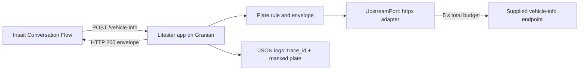

# Car-insurance onboarding: vehicle-lookup proxy and Insait flow

[](https://github.com/yanai-sh/onboarding-flow/actions/workflows/ci.yml)

This is my submission for the Encore AI Forward Deployed Engineer take-home. It has two parts:

- **Part A (this repository):** a small, stateless API proxy for the supplied vehicle-info
  endpoint, deployed on Cloud Run. It gives the conversation one typed, speakable contract for
  every lookup outcome.
- **Part B (Insait platform):** a Conversation Flow Agent that onboards an applicant for
  Comprehensive or Mandatory car insurance and calls the proxy from an API node.

The assignment PDF is not redistributed here.

## Links

- Live service: <https://onboarding-flow-2q2x6qga6a-uc.a.run.app>
- Swagger UI: <https://onboarding-flow-2q2x6qga6a-uc.a.run.app/schema/swagger>
- OpenAPI: <https://onboarding-flow-2q2x6qga6a-uc.a.run.app/schema/openapi.json>

The live service runs the most recently deployed commit, which can trail `main`.

## Submission

| Item | Value |
|---|---|
| Insait workspace | `TODO: workspace name` |
| Agent | `TODO: agent name` |
| Flow link | `TODO: flow URL` |
| Video (about 3 minutes) | `TODO: video URL` |

## Try it

The service scales to zero, so the first request after a quiet period can take a few seconds.

```bash
URL=https://onboarding-flow-2q2x6qga6a-uc.a.run.app

# Found. The upstream returns Hebrew values; the proxy passes them through unchanged.
curl -sS "$URL/vehicle-info" -H 'Content-Type: application/json' -d '{"license_plate":"12345678"}'
# {"success":true,"data":{"license_plate":"12345678","manufacturer":"טויוטה","model":"קורולה",
#  "year":2020,"color":"לבן"},"error_code":null,"message":null,"trace_id":"…"}

# Dashes, dots, and spaces are ignored: the upstream receives 12345678 and the body is the same.
curl -sS "$URL/vehicle-info" -H 'Content-Type: application/json' -d '{"license_plate":"123-45-678"}'

# Not found.
curl -sS "$URL/vehicle-info" -H 'Content-Type: application/json' -d '{"license_plate":"00000000"}'
# {"success":false,"data":null,"error_code":"VEHICLE_NOT_FOUND","message":"We couldn't find a
#  vehicle with that plate number. Please check it and try again.","trace_id":"…"}

# A plate that breaks the rule is still HTTP 200; the upstream is not called.
curl -sS "$URL/vehicle-info" -H 'Content-Type: application/json' -d '{"license_plate":"ABC"}'
# {"success":false,"data":null,"error_code":"INVALID_REQUEST","message":"That plate number
#  doesn't look right. Israeli plates have 7 or 8 digits.","trace_id":"…"}
```

## Contract

`POST /vehicle-info` takes `{"license_plate": "..."}`. The proxy removes spaces, dashes, and
dots, then requires 7 or 8 ASCII digits (the Israeli format the upstream enforces). Every lookup
outcome returns HTTP 200 with `success`, `data`, `error_code`, `message`, and `trace_id`. The
`message` is a short English sentence with no request data in it.

| `error_code` | When | How the flow reacts |
|---|---|---|
| `INVALID_REQUEST` | The plate breaks the rule, or the upstream rejects it (400/422) | Re-ask for the plate with the format hint |
| `VEHICLE_NOT_FOUND` | The upstream has no vehicle for the plate | Ask the applicant to re-check the plate; after two failed lookups, offer to continue unverified |
| `UPSTREAM_TIMEOUT` | No complete upstream answer within the 5-second budget | Offer one retry, then continue with the vehicle marked unverified |
| `UPSTREAM_UNAVAILABLE` | Network error, 5xx, or any other unexpected status (including a 404 without the registry's not-found body) | Same as timeout |
| `UPSTREAM_INVALID_RESPONSE` | The upstream answered 200 with a body the proxy cannot validate | Same as timeout |

A body that is not JSON, a missing `license_plate`, a non-string value, or a string over 32
characters returns a framework HTTP 400. Those are integration bugs, not applicant typos.

## Design decisions

- **Every lookup outcome is an HTTP 200 envelope with a stable `error_code`.** The consumer is an
  Insait API node that has to route and then say something useful; an unstructured 5xx or a
  framework validation body gives it nothing to say. See
  [ADR 0003](docs/adr/0003-invalid-plate-in-envelope.md), which supersedes
  [ADR 0001](docs/adr/0001-proxy-validation-4xx.md).
- **The proxy enforces the upstream's plate rule and normalizes separators.** People write
  `12-345-67` and `123-45-678`, and an LLM may save the plate as spoken. Validating first means a
  typo never reaches the upstream, and a bad plate is never reported as an outage.
- **One bounded call, no retries.** A person is waiting, and automatic retries stretch latency
  and add load to an upstream that is already struggling. The 5-second budget covers the whole
  exchange (connect, send, and the full body), and retrying is a choice the flow offers the user.
- **One HTTP stack and one logging pipeline.** `httpx` for outbound calls and stdlib `logging`
  with a JSON formatter for Cloud Logging. Granian settings are image environment defaults so
  the SIGTERM grace fits Cloud Run. See [ADR 0002](docs/adr/0002-httpx-stdlib-logging-granian-env.md).
- **Stateless, with minimal PII in logs.** Nothing is persisted. Every log line carries the
  request `trace_id`, plates appear only as a mask such as `****5678`, and bodies, names,
  phone numbers, and emails are never logged.
- **Cloud Run, scaled to zero, deployed by immutable image tag.** Terraform deploys the git short
  SHA, so each deploy rolls a new revision and rollback is one `apply`. The service is public
  because the Insait API node calls it without credentials.

## Architecture



Module seams, the status mapping, and the log events are in [`ARCHITECTURE.md`](ARCHITECTURE.md).

## Insait flow

The flow has seven nodes: five conversation nodes with save tools, one API node for the lookup,
and an end node. Business branching uses expression edges, and conversational judgment uses
LLM exits. The flow is configured by hand in the Insait UI; nothing in this repository creates
or changes it. The design, validation rules, correction handling, and test record are in
[`docs/insait-flow.md`](docs/insait-flow.md).

## Run locally

Requires [uv](https://docs.astral.sh/uv/); uv installs Python 3.14 from `.python-version`.

```bash
uv sync
./scripts/check.sh                 # ruff lint and format check, ty, unit tests
uv run granian --interface asgi --port 8080 onboarding_flow.app:app
./scripts/check-image.sh           # build the image with docker buildx and smoke-test it
```

Configuration is optional: `UPSTREAM_URL` defaults to the supplied endpoint,
`UPSTREAM_TIMEOUT_SECONDS` to 5, and `LOG_LEVEL` to `INFO`. The Dockerfile needs BuildKit, so
the image scripts use `docker buildx`.

## Deploy

Terraform provisions Artifact Registry and Cloud Run, and Cloud Build builds the image; the
steps, rollback, and teardown are in [`infra/README.md`](infra/README.md).

## What I would do next in production

- Authenticate the caller (a shared-secret header or Cloud Run IAM with a service identity) and
  add per-caller rate limiting.
- Run a scheduled contract test against the real upstream to catch status or schema drift early.
- Define an SLO on lookup success and alert on the `upstream_request_failed` rate from the
  structured logs.
- Set `min_instances` to 1 so the first lookup of a conversation does not pay a cold start.
- Add a short-TTL cache and a circuit breaker once real traffic shows repeat lookups or
  upstream incidents.
- Deploy from CI with Workload Identity Federation instead of a local `gcloud` session.

## AI tooling

I built this with Cursor agents. The project-specific guidance I wrote for them is in
[`AGENTS.md`](AGENTS.md) and `.cursor/rules/`; third-party skills were used locally and are not
part of this repository.
