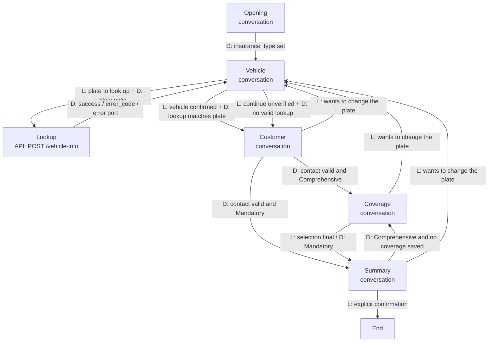

# Insait flow: design and test record

The Conversation Flow Agent is built by hand in the Insait platform UI. Nothing in this
repository creates, deploys, or tests it. This document is the design to build from and the test
record to complete in the Test Agent debug view (⋮ → Show debug info). The workspace, agent,
flow link, and video go in the [README](../README.md#submission).

There is no public Insait builder documentation, so node semantics come from the assignment.
Items marked **[verify in UI]** are assumptions about platform features, each with a fallback.

## Graph

Seven nodes: five conversation nodes, one API node, and an end node. **D** marks a
deterministic expression edge; **L** marks an LLM-evaluated exit.

## Nodes

| Node | Type | Why this type | Saves | Exits |
|---|---|---|---|---|
| Opening | Conversation | A natural welcome that accepts answers out of order; the choice drives a business branch, so the exit is an expression. | `insurance_type`; any other valid field volunteered | D: `insurance_type` is `Comprehensive` or `Mandatory` → Vehicle |
| Vehicle | Conversation | Collecting a plate as people say it and judging "yes, that's my car" are conversational. Only the call itself is strict. | `license_plate` | L "plate to look up" + D `license_plate` matches `^\d{7,8}$` → Lookup. L "confirmed the shown vehicle" + D `lookup_success == true AND vehicle_plate == license_plate` → Customer. L "chose to continue unverified" + D `lookup_success != true OR vehicle_plate != license_plate` → Customer |
| Lookup | API | The call must run on the validated plate and route the same way every time. Response mapping copies the Hebrew values without LLM transcription, and the branch shows in debug. | `lookup_*`, `vehicle_*` by response mapping | D: every outcome → Vehicle, which words its reply from `lookup_error_code` |
| Customer | Conversation | Three validated fields in any order, skipping those already saved. The assignment rules out the Collect Node. | `full_name`, `phone`, `email` | D: `full_name` set, `phone` matches `^05\d{8}$`, `email` matches the email rule, and `Comprehensive` → Coverage; the same with `Mandatory` → Summary. L: change plate → Vehicle |
| Coverage | Conversation | A multi-select in natural language. Only Comprehensive reaches it: Mandatory covers bodily injury only, so property add-ons do not apply. | `coverage_options` | L "selection is final, including none" → Summary. D: `insurance_type == Mandatory` → Summary. L: change plate → Vehicle |
| Summary | Conversation | Reading back every saved value and judging an explicit confirmation or a correction. | Re-saves any corrected field | L "explicitly confirmed" → End. D: `Comprehensive` and `coverage_options` unset → Coverage. L: change plate → Vehicle |
| End | End [verify in UI] | A deterministic finish: thank the applicant, say a licensed agent will follow up, give `lookup_trace_id` as a reference. No policy is issued. | — | — |

If a conversation node can end the chat, End can be dropped (six nodes).

The Vehicle exits combine an LLM condition with an expression guard on one edge [verify in UI].
If an edge must be one or the other, use L-only exits with the guard written into the condition
text; the proxy's `INVALID_REQUEST` backstops the plate, and the Vehicle prompt offers
confirmation only after a successful lookup of the current plate.

The lookup is its own API node rather than a tool inside Vehicle. As a tool, the LLM would decide
when, or whether, to call it, and could skip the call, repeat it, or invent vehicle details. As
a node, the graph guarantees the call and routes on its result.

### Variables

| Variable | Canonical form |
|---|---|
| `insurance_type` | `Comprehensive` or `Mandatory` |
| `license_plate` | 7 or 8 digits, no separators |
| `vehicle_plate`, `vehicle_manufacturer`, `vehicle_model`, `vehicle_year`, `vehicle_color` | As returned (Hebrew text; the year is an integer) |
| `full_name`, `phone`, `email` | Trimmed; phone as `05XXXXXXXX`; email lowercased |
| `coverage_options` | A subset of `windshield`, `extended_third_party`, `replacement_vehicle`; empty means none |
| `lookup_success`, `lookup_error_code`, `lookup_message`, `lookup_trace_id` | From the proxy envelope |

Variables hold English tokens so expressions stay language-independent; replies follow the
applicant's language. If the platform cannot tell "unset" from an empty list [verify in UI],
save `["none"]` for no add-ons.

## Lookup API node

| Setting | Value |
|---|---|
| Request | `POST https://onboarding-flow-2q2x6qga6a-uc.a.run.app/vehicle-info`, `Content-Type: application/json`, body `{"license_plate": "{{license_plate}}"}` |
| Trace header | Optional `X-Trace-ID` set to the conversation id, if the platform exposes one [verify in UI]. The proxy accepts 1–128 printable ASCII characters and stamps it on every log line. |
| Timeout | At least 10 s if configurable [verify in UI]: the 5 s upstream budget plus a Cloud Run cold start |
| Retries | None on the node. Retrying is a choice the agent offers the applicant. |
| Mapping | `success`, `error_code`, `message`, `trace_id` → `lookup_*`; `data.license_plate` → `vehicle_plate`; `data.manufacturer`, `data.model`, `data.year`, `data.color` → `vehicle_*` |

If response mapping is unavailable [verify in UI], Vehicle's save tool saves the vehicle fields.
How the error port sets variables is unknown [verify in UI]; mapping probably does not run, so
`lookup_*` stays unset or stale. If the error edge can assign variables, set
`lookup_success = false` there. Either way the unverified guard opens, because it treats unset
and stale results as "no valid lookup". Vehicle and Summary show vehicle values only when the
confirm guard holds, so an earlier plate's vehicle is never presented as the current car.

| Outcome | Arrives as | The agent | Next |
|---|---|---|---|
| Found | `success: true` | Shows "2020 טויוטה קורולה, לבן" (translated in English replies) and asks "Is this your car?" | Confirmed → Customer; "not mine" → re-ask the plate |
| `INVALID_REQUEST` | `success: false` | Says 7 or 8 digits are expected | Re-ask; never re-send the same value; no unverified option |
| `VEHICLE_NOT_FOUND` | `success: false` | Asks the applicant to double-check the number | Re-ask; after two failed lookups, offer to continue unverified |
| `UPSTREAM_TIMEOUT`, `UPSTREAM_UNAVAILABLE`, `UPSTREAM_INVALID_RESPONSE` | `success: false` | Says the registry is not answering right now | One retry the applicant agrees to, then offer to continue unverified |
| Error port | HTTP 400 (malformed body), 5xx, network failure, node timeout | Same as unavailable | Same as unavailable |

The agent speaks the meaning of `lookup_message` in the applicant's language, never the
`error_code`. Continuing unverified keeps the lead, and Summary shows the vehicle as "not yet
verified; an agent will confirm it". The prompt, not a variable, counts the two-lookup cap.

## Validation rules

The node prompt normalizes each value and saves it only when it passes; an invalid value is never
saved "for now". The expression exits re-check plate, phone, and email, and the proxy enforces
the plate rule again.

- **Plate:** remove spaces, `-`, and `.`; the result must match `^\d{7,8}$`
  (`123-45-678` becomes `12345678`).
- **Phone (Israeli mobile, a deliberate choice):** remove spaces, `-`, `(`, and `)`; replace a
  leading `+972`, `00972`, or `972` with `0`; the result must match `^05\d{8}$`.
- **Email:** trim and lowercase, then
  `^[A-Za-z0-9._%+-]+@[A-Za-z0-9-]+(?:\.[A-Za-z0-9-]+)*\.[A-Za-z]{2,}$`. For an obvious domain
  typo such as `gmial.com`, ask "Did you mean …?" instead of correcting it silently.
- **Full name:** at least two words of Hebrew or Latin letters, `'`, or `-`, 2–60 characters.
- **Insurance type and coverage:** map synonyms ("full", "מקיף"; "basic", "חובה"; "all",
  "none") to the canonical tokens. If the choice is ambiguous ("the cheapest one"), ask.

## Corrections mid-flow

The applicant can fix a detail at any node, not only at the summary:

1. **Re-save in place** for values with no side effects: `full_name`, `phone`, `email`,
   `insurance_type`, and `coverage_options`. Every node after the owning node lists them in its
   save tool, re-validates, re-saves, and confirms in one line. This relies on any node's save
   tool writing any variable [verify in UI]; the fallback is two more L exits, from Coverage and
   Summary to Customer.
2. **Exit back to the owning node** for the plate. A new plate invalidates the lookup, so
   Customer, Coverage, and Summary each have the L exit "wants to change the plate" → Vehicle.
   The `vehicle_plate == license_plate` guard forces a fresh lookup before confirmation.

A changed insurance type is re-saved in place, and expression edges repair the path
(Comprehensive at Summary → Coverage; Mandatory at Coverage → Summary, which drops add-ons).

Loop guards: each back-edge needs an explicit change request in the latest turn ("not when the
applicant only repeats the plate"); re-entered nodes ask only for what changed; Customer's
expression exits pass straight through [verify evaluation timing]; invalid input never leaves
its node.

## Off-script handling

- **Everything in the first message:** Opening saves every valid field, Vehicle confirms the
  plate in one line, and Customer's expression exit passes straight through.
- **Side questions** ("How much will it cost?"): one sentence (prices come from a licensed agent
  afterwards), then the pending question again. No exit condition matches a side question.
- **"Skip to the summary":** every forward edge requires validated saved values, and Summary
  requires an explicit confirmation, so the prompt cannot shortcut the steps.

## Test record

Warm the service first (`curl https://onboarding-flow-2q2x6qga6a-uc.a.run.app/health`). Use a
fresh Test Agent session per run with the debug view open.

- [ ] **Happy Comprehensive:** "Comprehensive", "12345678", "yes", "Dana Levi", "0501234567",
  "dana@example.com", "windshield and replacement car", "confirm". Path O → V → L → V → C → K →
  S → E; `vehicle_manufacturer` = טויוטה, `coverage_options` = `[windshield, replacement_vehicle]`.
- [ ] **Happy Mandatory:** the same with "Mandatory"; `insurance_type == Mandatory` skips Coverage.
- [ ] **Not found, then recover:** "00000000", then "12345678". The first lookup shows
  `VEHICLE_NOT_FOUND` and no vehicle; the second succeeds.
- [ ] **Invalid and dashed plates:** "ABC12" and "123" are re-asked with no Lookup in debug;
  "12-345-678" is saved as `12345678` and looked up.
- [ ] **Error port:** in a copy of the agent, point the node at `/nope` on the service (HTTP
  404). One retry is offered, then the unverified exit opens; Summary shows "not yet verified".
- [ ] **Registry down (optional):** deploy a temporary revision by adding
  `-var upstream_url=https://upstream.invalid/vehicle-info` (or `-var
  upstream_timeout_seconds=0.001`) to the usual `terraform apply -var image_tag=…`, then
  re-apply without it. Lookup returns HTTP 200
  `UPSTREAM_UNAVAILABLE` (or `UPSTREAM_TIMEOUT`) and follows the same retry-then-unverified path.
- [ ] **Invalid phone and email:** "050-12" and "+1 555 1234" are refused; "+972 50 123 4567"
  saves `0501234567`; "dana@" is refused before "dana@example.com" is saved.
- [ ] **Correction in place:** in Coverage, "my phone is actually 052-7654321". Stays in
  Coverage; `phone` = `0527654321`; no back-edge in debug.
- [ ] **Plate correction at Summary:** "the plate is wrong, it's 1234567". Path S → V → L → V →
  C → K → S; the old vehicle is not offered for confirmation.
- [ ] **Late type switch:** at a Mandatory Summary, "make it comprehensive" → Coverage → Summary.
- [ ] **Side question and "not my car":** "how much does it cost?" in Customer causes no node
  change; "no, that's not my car" after a found lookup re-asks the plate.
- [ ] **Hebrew:** the happy Comprehensive run in Hebrew ("מקיף", "12-345-678", …). Same saved
  state, with `insurance_type` = `Comprehensive`; replies in Hebrew.
