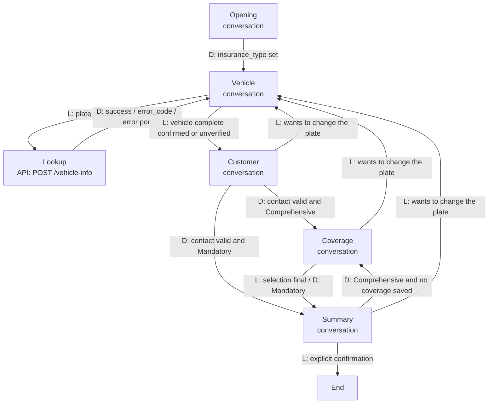

# Insait flow: design and test record

The Conversation Flow Agent is built by hand in the Insait platform UI. Nothing in this
repository creates, deploys, or tests it. This document is the design to build from and the test
record to complete in the Test Agent debug view (⋮ → Show debug info). The workspace, agent,
flow link, and video go in the [README](../README.md#submission).

There is no public Insait builder documentation, so node semantics come from the assignment.
Items marked **[verify in UI]** are assumptions about platform features, each with a fallback.

Live agent id: `d2c2df93-e514-4b99-a962-243752105fa0` (Encore AI Insurance). Platform actions below
are marked done only after a human confirms them in Insait.

## Live gap and HITL apply checklist

Insait allows only **one** Vehicle → Customer connector. Confirmed and unverified completion must
share that single LLM exit; do not add a second edge to Customer.

As of the last full export review, that exit (`Vehicle Confirmed`, `edge-1790111560877`) only
fires on a matching verified vehicle. The Vehicle prompt already offers unverified continuation
after eligible failures, but the exit condition ignores that path, so applicants can get stuck.
Phases A–C below are paste-ready for a human builder. Do not check them off until the change is
applied and smoke-tested in Insait.

### A. Broaden the single Vehicle → Customer exit (Critical) — pending human apply

On the **Vehicle** conversation node (`conversation-node`):

1. Keep the existing LLM exit to **Customer** (`node-1790108830528`). Rename it to
   **Vehicle Complete** if the UI allows (optional).
2. Replace its condition prompt with:

```text
Fire when exactly one of these two paths is true. Say nothing when firing.

Path A — verified confirmation:
- lookup_success is true
- vehicle_plate equals license_plate
- vehicle_year, vehicle_manufacturer, vehicle_model, and vehicle_color are non-empty
- the applicant's latest message confirms the displayed vehicle

Path B — explicit unverified continuation:
- there is no verified match for the current plate (lookup_success is not true, or vehicle_plate does not equal license_plate, or required vehicle fields are empty)
- the immediately preceding assistant message offered to continue without registry verification after an eligible failure (second completed VEHICLE_NOT_FOUND, or second completed technical failure after an accepted retry)
- the applicant's latest message explicitly accepts that offer

Do not fire for the first not-found or first technical failure, INVALID_REQUEST, invalid local input, rejection of a shown vehicle, side questions, mere repetition of the plate, or unverified continuation that was never offered.
```

3. Replace the exit `context_message` with:

```text
Vehicle step done for {{license_plate}}. Verified only if lookup_success is true and vehicle_plate equals license_plate; otherwise unverified. Next: full_name, phone, email — skip any already saved. Do not present registry details as confirmed unless verified.
```

4. Keep the Vehicle prompt failure rules unchanged (they still offer unverified only after eligible
   second failures). Do not add another Vehicle → Customer edge.
5. Publish the flow.

Smoke (Test Agent + debug), after warming
`curl https://onboarding-flow-2q2x6qga6a-uc.a.run.app/health`:

- [ ] Happy path still works: `Mandatory` → `12345678` → `yes` → Customer.
- [ ] `Mandatory` → `00000000` → not found → second completed not-found → accept continue
  unverified → contact → Summary shows vehicle not yet verified.
- [ ] After only one not-found, accepting continue must remain in Vehicle.
- [ ] Technical path (optional): two completed Lookup failures with an accepted retry between
  them, then accept unverified.

- [ ] **A applied and smoke-tested in Insait** (human confirmed)

### B. Customer prompt and tool schema (Low–Medium) — pending human apply

**Customer node prompt:** remove the conflicting language-gate line
`Do not acknowledge vehicle confirmation; immediately ask only for the next missing contact field.`
Keep the first-entry rule that briefly acknowledges confirmed vs unverified, then asks one missing
field. Paste-ready Customer prompt:

```text
Language gate — apply before every other instruction:
conversation_language="{{conversation_language}}"

- If conversation_language is "he", output Hebrew only.
- If conversation_language is "en" or empty, output English only.
- Numeric input, email, canonical values, and node transitions never change the language.

Current State:
license_plate="{{license_plate}}"
lookup_success="{{lookup_success}}"
vehicle_plate="{{vehicle_plate}}"
full_name="{{full_name}}"
phone="{{phone}}"
email="{{email}}"

Collect full_name, phone, and email.

Accept valid fields in any order and accept several fields in one message. Save each valid field independently and skip fields already saved.

On the first request in this node:
- If lookup_success is true and vehicle_plate equals license_plate, briefly say the vehicle was confirmed.
- Otherwise, briefly say that a licensed agent will verify the vehicle later.

Then ask for exactly one missing field at a time:

When full_name is missing:
- he: מה שמך המלא?
- en: What is your full name?

When phone is missing:
- he: מהו מספר הטלפון הנייד הישראלי שבו נשתמש?
- en: What Israeli mobile number should we use?

When email is missing:
- he: מהי כתובת האימייל שבה נשתמש?
- en: What email address should we use?

Apply the global validation and normalization rules.

If a value is invalid, explain the expected form briefly and re-ask only that field.

If the applicant provides several fields and one is invalid, save the valid fields and ask only for the invalid or missing field.

If the applicant explicitly wants to change the plate or vehicle, do not overwrite license_plate. Say nothing and take the plate-change exit.

Once full_name, phone, and email are valid, say nothing; the flow proceeds automatically.
```

**Encore AI Tools** (`lookup_vehicle_info`): set `function_definition.parameters.required` to
`["license_plate"]` (not `query`). Keep the `license_plate` property, body template
`{"license_plate": "{{license_plate}}"}`, and response mappings unchanged.

**Lookup wait feedback [verify in UI]:** if the builder exposes acknowledgements for the Lookup
API node, enable a short wait message. Skip if the control is unclear.

- [ ] **B applied in Insait** (human confirmed)

### C. Quality gate and new strict replays (High) — pending human apply

1. After A and B, run all existing 27 strict replays against the published version.
2. Include at least these in the quality gate: CORE-01…04, VEHICLE-01…02, CORRECTION-06,
   SUMMARY-01…02, INPUT-04.
3. Create the new strict sets in the section [Strict replay drafts](#strict-replay-drafts)
   (folder `06-vehicle-recovery-offscript` for VEHICLE-*, `05-corrections-backtracking` for
   CORRECTION-*, new or `03-contact-validation` for SECURITY-01).
4. Paste pass/fail into the Test record checkboxes below; never mark a case done without a run.

- [ ] **C: 27 stricts run; core set in quality gate** (human confirmed; gate result: `________`)
- [ ] **C: new strict sets created** (human confirmed)

## Graph

Seven nodes: five conversation nodes, one API node, and an end node. **D** marks a
deterministic expression edge; **L** marks an LLM-evaluated exit.


```mermaid
flowchart TD
  O["Opening<br/>conversation"] -->|"D: insurance_type set"| V["Vehicle<br/>conversation"]
  V -->|"L: plate to look up"| L["Lookup<br/>API: POST /vehicle-info"]
  L -->|"D: success / error_code / error port"| V
  V -->|"L: vehicle complete confirmed or unverified"| C["Customer<br/>conversation"]
  C -->|"D: contact valid and Comprehensive"| K["Coverage<br/>conversation"]
  C -->|"D: contact valid and Mandatory"| S["Summary<br/>conversation"]
  K -->|"L: selection final / D: Mandatory"| S
  S -->|"D: Comprehensive and no coverage saved"| K
  S -->|"L: explicit confirmation"| E["End"]
  C & K & S -->|"L: wants to change the plate"| V
```

## Nodes

| Node | Type | Why this type | Saves | Exits |
|---|---|---|---|---|
| Opening | Conversation | A natural welcome that accepts answers out of order; the choice drives a business branch, so the exit is an expression. | `insurance_type`; any other valid field volunteered | D: `insurance_type` is `Comprehensive` or `Mandatory` → Vehicle |
| Vehicle | Conversation | Collecting a plate as people say it and judging "yes, that's my car" are conversational. Only the call itself is strict. | `license_plate` | L "plate to look up" → Lookup. One L exit "vehicle complete" → Customer: either confirmed matching lookup, or explicit accept of offered unverified continuation after an eligible second failure. Insait allows only one Vehicle → Customer connector, so both paths share that exit condition. |
| Lookup | API | The call must run on the validated plate and route the same way every time. Response mapping copies the Hebrew values without LLM transcription, and the branch shows in debug. | `lookup_*`, `vehicle_*` by response mapping | D: every outcome → Vehicle, which words its reply from `lookup_error_code` |
| Customer | Conversation | Three validated fields in any order, skipping those already saved. The assignment rules out the Collect Node. | `full_name`, `phone`, `email` | D: `full_name` set, `phone` matches `^05\d{8}$`, `email` matches the email rule, and `Comprehensive` → Coverage; the same with `Mandatory` → Summary. L: change plate → Vehicle |
| Coverage | Conversation | A multi-select in natural language. Only Comprehensive reaches it: Mandatory covers bodily injury only, so property add-ons do not apply. | `coverage_options` | L "selection is final, including none" → Summary. D: `insurance_type == Mandatory` → Summary. L: change plate → Vehicle |
| Summary | Conversation | Reading back every saved value and judging an explicit confirmation or a correction. | Re-saves any corrected field | L "explicitly confirmed" → End. D: `Comprehensive` and `coverage_options` unset → Coverage. L: change plate → Vehicle |
| End | End [verify in UI] | A deterministic finish: thank the applicant, say a licensed agent will follow up, give `lookup_trace_id` as a reference. No policy is issued. | — | — |

If a conversation node can end the chat, End can be dropped (six nodes).

Insait allows only one Vehicle → Customer connector, so confirmed and unverified completion share
a single L exit whose condition text encodes both paths. The proxy's `INVALID_REQUEST` backstops
the plate. The Vehicle prompt offers confirmation only after a successful lookup of the current
plate, and offers unverified continuation only after an eligible second failure.

The lookup is its own API node rather than a tool inside Vehicle. As a tool, the LLM would decide
when, or whether, to call it, and could skip the call, repeat it, or invent vehicle details. As
a node, the graph guarantees the call and routes on its result.

### Variables

| Variable | Canonical form |
|---|---|
| `insurance_type` | `Comprehensive` or `Mandatory` |
| `license_plate` | 7 or 8 digits, no separators |
| `vehicle_plate`, `vehicle_manufacturer`, `vehicle_model`, `vehicle_year`, `vehicle_color` | As returned (Hebrew text; the year is an integer) |
| `full_name`, `phone`, `email` | Trimmed; phone as `05XXXXXXXX`; email lowercased |
| `coverage_options` | A subset of `windshield`, `extended_third_party`, `replacement_vehicle`; empty means none |
| `lookup_success`, `lookup_error_code`, `lookup_message`, `lookup_trace_id` | From the proxy envelope |

Variables hold English tokens so expressions stay language-independent; replies follow the
applicant's language. If the platform cannot tell "unset" from an empty list [verify in UI],
save `["none"]` for no add-ons.

## Lookup API node

| Setting | Value |
|---|---|
| Request | `POST https://onboarding-flow-2q2x6qga6a-uc.a.run.app/vehicle-info`, `Content-Type: application/json`, body `{"license_plate": "{{license_plate}}"}` |
| Trace header | Optional `X-Trace-ID` set to the conversation id, if the platform exposes one [verify in UI]. The proxy accepts 1–128 printable ASCII characters and stamps it on every log line. |
| Timeout | At least 10 s if configurable [verify in UI]: the 5 s upstream budget plus a Cloud Run cold start |
| Retries | None on the node. Retrying is a choice the agent offers the applicant. |
| Mapping | `success`, `error_code`, `message`, `trace_id` → `lookup_*`; `data.license_plate` → `vehicle_plate`; `data.manufacturer`, `data.model`, `data.year`, `data.color` → `vehicle_*` |

If response mapping is unavailable [verify in UI], Vehicle's save tool saves the vehicle fields.
How the error port sets variables is unknown [verify in UI]; mapping probably does not run, so
`lookup_*` stays unset or stale. If the error edge can assign variables, set
`lookup_success = false` there. Either way the unverified guard opens, because it treats unset
and stale results as "no valid lookup". Vehicle and Summary show vehicle values only when the
confirm guard holds, so an earlier plate's vehicle is never presented as the current car.

| Outcome | Arrives as | The agent | Next |
|---|---|---|---|
| Found | `success: true` | Shows "2020 טויוטה קורולה, לבן" (translated in English replies) and asks "Is this your car?" | Confirmed → Customer; "not mine" → re-ask the plate |
| `INVALID_REQUEST` | `success: false` | Says 7 or 8 digits are expected | Re-ask; never re-send the same value; no unverified option |
| `VEHICLE_NOT_FOUND` | `success: false` | Asks the applicant to double-check the number | Re-ask; after two failed lookups, offer to continue unverified |
| `UPSTREAM_TIMEOUT`, `UPSTREAM_UNAVAILABLE`, `UPSTREAM_INVALID_RESPONSE` | `success: false` | Says the registry is not answering right now | One retry the applicant agrees to, then offer to continue unverified |
| Error port | HTTP 400 (malformed body), 5xx, network failure, node timeout | Same as unavailable | Same as unavailable |

The agent speaks the meaning of `lookup_message` in the applicant's language, never the
`error_code`. Continuing unverified keeps the lead, and Summary shows the vehicle as "not yet
verified; an agent will confirm it". The prompt, not a variable, counts the two-lookup cap.

## Validation rules

The node prompt normalizes each value and saves it only when it passes; an invalid value is never
saved "for now". The expression exits re-check plate, phone, and email, and the proxy enforces
the plate rule again.

- **Plate:** remove spaces, `-`, and `.`; the result must match `^\d{7,8}$`
  (`123-45-678` becomes `12345678`).
- **Phone (Israeli mobile, a deliberate choice):** remove spaces, `-`, `(`, and `)`; replace a
  leading `+972`, `00972`, or `972` with `0`; the result must match `^05\d{8}$`.
- **Email:** trim and lowercase, then
  `^[A-Za-z0-9._%+-]+@[A-Za-z0-9-]+(?:\.[A-Za-z0-9-]+)*\.[A-Za-z]{2,}$`. For an obvious domain
  typo such as `gmial.com`, ask "Did you mean …?" instead of correcting it silently.
- **Full name:** at least two words of Hebrew or Latin letters, `'`, or `-`, 2–60 characters.
- **Insurance type and coverage:** map synonyms ("full", "מקיף"; "basic", "חובה"; "all",
  "none") to the canonical tokens. If the choice is ambiguous ("the cheapest one"), ask.

## Corrections mid-flow

The applicant can fix a detail at any node, not only at the summary:

1. **Re-save in place** for values with no side effects: `full_name`, `phone`, `email`,
   `insurance_type`, and `coverage_options`. Every node after the owning node lists them in its
   save tool, re-validates, re-saves, and confirms in one line. This relies on any node's save
   tool writing any variable [verify in UI]; the fallback is two more L exits, from Coverage and
   Summary to Customer.
2. **Exit back to the owning node** for the plate. A new plate invalidates the lookup, so
   Customer, Coverage, and Summary each have the L exit "wants to change the plate" → Vehicle.
   The `vehicle_plate == license_plate` guard forces a fresh lookup before confirmation.

A changed insurance type is re-saved in place, and expression edges repair the path
(Comprehensive at Summary → Coverage; Mandatory at Coverage → Summary, which drops add-ons).

Loop guards: each back-edge needs an explicit change request in the latest turn ("not when the
applicant only repeats the plate"); re-entered nodes ask only for what changed; Customer's
expression exits pass straight through [verify evaluation timing]; invalid input never leaves
its node.

## Off-script handling

- **Everything in the first message:** Opening saves every valid field, Vehicle confirms the
  plate in one line, and Customer's expression exit passes straight through.
- **Side questions** ("How much will it cost?"): one sentence (prices come from a licensed agent
  afterwards), then the pending question again. No exit condition matches a side question.
- **"Skip to the summary":** every forward edge requires validated saved values, and Summary
  requires an explicit confirmation, so the prompt cannot shortcut the steps.

## Test record

Warm the service first (`curl https://onboarding-flow-2q2x6qga6a-uc.a.run.app/health`). Use a
fresh Test Agent session per run with the debug view open. Check a box only after a human confirms
the run against the published agent version.

### Manual / debug checklist

- [ ] **Happy Comprehensive:** "Comprehensive", "12345678", "yes", "Dana Levi", "0501234567",
  "dana@example.com", "windshield and replacement car", "confirm". Path O → V → L → V → C → K →
  S → E; `vehicle_manufacturer` = טויוטה, `coverage_options` = `[windshield, replacement_vehicle]`.
- [ ] **Happy Mandatory:** the same with "Mandatory"; `insurance_type == Mandatory` skips Coverage.
- [ ] **Not found, then recover:** "00000000", then "12345678". The first lookup shows
  `VEHICLE_NOT_FOUND` and no vehicle; the second succeeds.
- [ ] **Invalid and dashed plates:** "ABC12" and "123" are re-asked with no Lookup in debug;
  "12-345-678" is saved as `12345678` and looked up.
- [ ] **Error port:** in a copy of the agent, point the node at `/nope` on the service (HTTP
  404). One retry is offered, then the unverified exit opens; Summary shows "not yet verified".
- [ ] **Registry down (optional):** deploy a temporary revision by adding
  `-var upstream_url=https://upstream.invalid/vehicle-info` (or `-var
  upstream_timeout_seconds=0.001`) to the usual `terraform apply -var image_tag=…`, then
  re-apply without it. Lookup returns HTTP 200
  `UPSTREAM_UNAVAILABLE` (or `UPSTREAM_TIMEOUT`) and follows the same retry-then-unverified path.
- [ ] **Invalid phone and email:** "050-12" and "+1 555 1234" are refused; "+972 50 123 4567"
  saves `0501234567`; "dana@" is refused before "dana@example.com" is saved.
- [ ] **Correction in place:** in Coverage, "my phone is actually 052-7654321". Stays in
  Coverage; `phone` = `0527654321`; no back-edge in debug.
- [ ] **Plate correction at Summary:** "the plate is wrong, it's 1234567". Path S → V → L → V →
  C → K → S; the old vehicle is not offered for confirmation.
- [ ] **Plate correction at Customer:** after vehicle confirm, before contacts are complete,
  "the plate is wrong" → Vehicle; old vehicle is not reconfirmed as current.
- [ ] **Plate correction at Coverage:** after add-ons are offered, "change the plate" → Vehicle;
  prior registry details are not shown as matching the new plate until a fresh lookup.
- [ ] **Late type switch:** at a Mandatory Summary, "make it comprehensive" → Coverage → Summary.
- [ ] **Side question and "not my car":** "how much does it cost?" in Customer causes no node
  change; "no, that's not my car" after a found lookup re-asks the plate.
- [ ] **Hebrew:** the happy Comprehensive run in Hebrew ("מקיף", "12-345-678", …). Same saved
  state, with `insurance_type` = `Comprehensive`; replies in Hebrew.
- [ ] **Unverified continuation (second not-found):** after two completed not-found lookups,
  accept continue unverified; Customer does not present registry details; Summary shows not yet
  verified; closing still provides name, phone, email, and an applicant-facing reference.
- [ ] **Unverified not offered after one not-found:** after a single not-found, the agent asks to
  check the plate and does not leave Vehicle on "continue anyway".
- [ ] **Valid contacts under security:** after vehicle confirm, a bundled
  `Dana Levi, 050-123-4567, dana@example.com` is accepted (no security block) and reaches Summary.

### Strict replay drafts

Create these in Insait Testing after the Continue Unverified exit is live. Use
`tool_overrides.lookup_vehicle_info` with `mode: test_url` against the live proxy unless the case
needs a forced error port.

#### VEHICLE-05 Second not-found then unverified

- Folder: `06-vehicle-recovery-offscript`
- `flow_questions`:
  1. `Mandatory`
  2. `00000000`
  3. `00000000`
  4. `yes, continue without verification`
  5. `Dana Levi, 050-123-4567, dana@example.com`
  6. `yes`
- `expected_outcome`: After two completed not-found lookups the agent offers unverified
  continuation. Acceptance leaves Vehicle for Customer without presenting registry vehicle
  fields. Summary shows Mandatory, plate 00000000, vehicle not yet verified, contacts, and
  add-ons not applicable. After final confirmation, End sends the closing with name, normalized
  phone, email, and an applicant-facing reference. No policy-issued claim.

#### VEHICLE-06 Technical failure then unverified

- Folder: `06-vehicle-recovery-offscript`
- Requires a Lookup path that fails twice (error port or forced unavailable). Prefer a temporary
  agent copy pointed at `/nope`, or a tool override that yields non-2xx, if the Testing UI allows.
- `flow_questions`:
  1. `Mandatory`
  2. `12345678`
  3. `yes` (accept first retry offer)
  4. `yes, continue without verification` (after second failure)
  5. `Dana Levi, 050-123-4567, dana@example.com`
  6. `yes`
- `expected_outcome`: First completed technical failure offers one retry only. After the
  applicant accepts and the second completed technical failure returns, unverified continuation
  is offered and accepted. Summary marks the vehicle not yet verified. Closing is normal.

#### VEHICLE-07 One not-found does not unlock unverified

- Folder: `06-vehicle-recovery-offscript`
- `flow_questions`:
  1. `Mandatory`
  2. `00000000`
  3. `continue without verification`
- `expected_outcome`: After a single not-found result the agent asks the applicant to
  double-check the plate, does not show a vehicle, does not open Customer, and remains in
  Vehicle. Continue Unverified must not fire.

#### SECURITY-01 Valid bundled contacts are not blocked

- Folder: `03-contact-validation`
- `flow_questions`:
  1. `Mandatory`
  2. `12345678`
  3. `yes`
  4. `yanai klugman 0531234567, me@yanai.sh`
  5. `yes`
- `expected_outcome`: The contact turn is not security-blocked. Name, phone `0531234567`, and
  email `me@yanai.sh` are saved. Summary and closing use those values. Regression for historical
  conversation `5209f1f2`.

#### CORRECTION-07 Plate change from Customer

- Folder: `05-corrections-backtracking`
- `flow_questions`:
  1. `Mandatory`
  2. `12345678`
  3. `yes`
  4. `the plate is wrong`
  5. `00000000`
- `expected_outcome`: Explicit plate-change from Customer returns to Vehicle without overwriting
  the plate in Customer. After `00000000` is looked up, the agent reports not found and does not
  present the prior Toyota as the current vehicle. Remains in Vehicle.

#### CORRECTION-08 Plate change from Coverage

- Folder: `05-corrections-backtracking`
- `flow_questions`:
  1. `Comprehensive`
  2. `12345678`
  3. `yes`
  4. `Dana Levi, 050-123-4567, dana@example.com`
  5. `the plate is wrong`
  6. `00000000`
- `expected_outcome`: Explicit plate-change from Coverage returns to Vehicle. Lookup of
  `00000000` reports not found; the old verified vehicle is not shown as current; no updated
  Comprehensive summary is presented until a matching vehicle is confirmed again.

### Deferred (not Part B take-home blockers)

Domain allowlist, legal disclaimer, retention days, `mask_pii`, fail-open / output-security policy,
and remapping lookup/vehicle variables away from `source=user` until a spoof reproduction exists.
