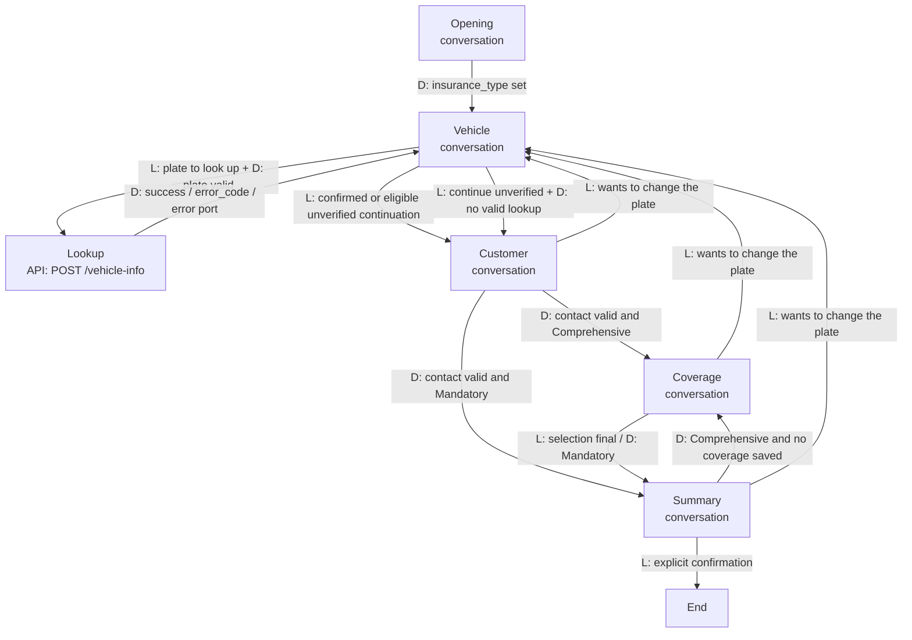

# Insait flow: design and test record

I built this Conversation Flow Agent manually in the Insait platform UI. The exported
configuration contains seven nodes and 36 test cases across ten suites. All tests passed on
2026-09-28. The workspace, flow link, and video go in the
[submission handoff](submission.md).

## Graph

Seven nodes: five conversation nodes, one API node, and an end node. **D** marks a
deterministic expression edge; **L** marks an LLM-evaluated exit.

```mermaid
flowchart TD
  O["Opening<br/>conversation"] -->|"D: insurance_type set"| V["Vehicle<br/>conversation"]
  V -->|"L: plate to look up + D: plate valid"| L["Lookup<br/>API: POST /vehicle-info"]
  L -->|"D: success / error_code / error port"| V
  V -->|"L: confirmed or eligible unverified continuation"| C["Customer<br/>conversation"]
  V -->|"L: continue unverified + D: no valid lookup"| C
  C -->|"D: contact valid and Comprehensive"| K["Coverage<br/>conversation"]
  C -->|"D: contact valid and Mandatory"| S["Summary<br/>conversation"]
  K -->|"L: selection final / D: Mandatory"| S
  S -->|"D: Comprehensive and no coverage saved"| K
  S -->|"L: explicit confirmation"| E["End"]
  C & K & S -->|"L: wants to change the plate"| V
```

## Nodes

| Node | Type | Why this type | Saves | Exits |
|---|---|---|---|---|
| Opening | Conversation | A natural welcome that accepts answers out of order; the choice drives a business branch, so the exit is an expression. | `insurance_type`; any other valid field volunteered | D: `insurance_type` is `Comprehensive` or `Mandatory` → Vehicle |
| Vehicle | Conversation | Collecting a plate as people say it and judging "yes, that's my car" are conversational. Prompt guards prevent lookup of invalid plates and prevent stale or missing vehicle data from being shown. | `license_plate`; volunteered fields | L: new valid plate or accepted retry → Lookup. L: confirmed matching vehicle or eligible unverified continuation → Customer |
| Lookup | API | The call must run on the validated plate and route the same way every time. Response mapping copies the Hebrew values without LLM transcription, and the branch shows in debug. | `lookup_*`, `vehicle_*` by response mapping | D: every outcome → Vehicle, which words its reply from `lookup_error_code` |
| Customer | Conversation | Three validated applicant fields in any order, skipping those already saved. The assignment rules out the Collect Node. | `full_name`, `phone`, `email` | D: valid contacts and `Comprehensive` → Coverage; valid contacts and `Mandatory` → Summary. L: change plate → Vehicle |
| Coverage | Conversation | A multi-select in natural language. Only Comprehensive reaches it: Mandatory covers bodily injury only, so property add-ons do not apply. | `coverage_options` | L "selection is final, including none" → Summary. D: `insurance_type == Mandatory` → Summary. L: change plate → Vehicle |
| Summary | Conversation | Reading back every saved value and judging an explicit confirmation or a correction. | Re-saves any corrected field | L "explicitly confirmed" → End. D: `Comprehensive` and `coverage_options` unset → Coverage. L: change plate → Vehicle |
| End Node | End | A deterministic finish: thank the applicant, say a licensed agent will follow up, and give the conversation ID as an applicant-facing reference. No policy is issued. | — | — |

The final flow uses LLM exits for conversational judgments and expression edges for contact and
insurance-type business rules. The Lookup node has an always edge for response envelopes and an
error edge for failures before an envelope is received.

The lookup is its own API node rather than a tool inside Vehicle. As a tool, the LLM would decide
when, or whether, to call it, and could skip the call, repeat it, or invent vehicle details. As
a node, the graph guarantees the call and routes on its result.

### Variables

| Variable | Canonical form |
|---|---|
| `insurance_type` | `Comprehensive` or `Mandatory` |
| `license_plate` | 7 or 8 digits, no separators |
| `vehicle_plate`, `vehicle_manufacturer`, `vehicle_model`, `vehicle_year`, `vehicle_color` | As returned (Hebrew text; the year is an integer) |
| `full_name`, `phone`, `email` | Trimmed; phone as `05XXXXXXXX`; email lowercased |
| `coverage_options` | A subset of `windshield`, `extended_third_party`, `replacement_vehicle`; empty means none |
| `lookup_success`, `lookup_error_code`, `lookup_message` | From the proxy envelope |

Variables hold English tokens so expressions stay language-independent; replies follow the
applicant's language. `["none"]` represents a final choice of no add-ons.

## Lookup API node

| Setting | Value |
|---|---|
| Request | `POST <CLOUD_RUN_URL>/vehicle-info`, `Content-Type: application/json`, body `{"license_plate": "{{license_plate}}"}`. Copy the current base URL from the [architecture guide](architecture.md#live-service). |
| Trace header | `X-Trace-ID: {{system__conversation_id}}` |
| Timeout | 30 s, allowing for the proxy's 5 s upstream budget and a Cloud Run cold start |
| Retries | None on the node. Retrying is a choice the agent offers the applicant. |
| Mapping | `success`, `error_code`, `message` → `lookup_success`, `lookup_error_code`, `lookup_message`; `data.license_plate` → `vehicle_plate`; `data.manufacturer`, `data.model`, `data.year`, `data.color` → `vehicle_*` |

The API node extracts the response fields directly. Its error edge returns to Vehicle with
context that one technical lookup failed before an envelope was received. Vehicle and Summary
show vehicle data only when `lookup_success` is true and `vehicle_plate` matches the current
plate, so an earlier vehicle is never presented as current.

| Outcome | Arrives as | The agent | Next |
|---|---|---|---|
| Found | `success: true` | Shows "2020 טויוטה קורולה, לבן" (translated in English replies) and asks "Is this your car?" | Confirmed → Customer; "not mine" → re-ask the plate |
| `INVALID_REQUEST` | `success: false` | Says 7 or 8 digits are expected | Re-ask; never re-send the same value; no unverified option |
| `VEHICLE_NOT_FOUND` | `success: false` | Asks the applicant to double-check the number | Re-ask; after two failed lookups, offer to continue unverified |
| `UPSTREAM_TIMEOUT`, `UPSTREAM_UNAVAILABLE`, `UPSTREAM_INVALID_RESPONSE` | `success: false` | Says the registry is not answering right now | One retry the applicant agrees to, then offer to continue unverified |
| Error port | HTTP 400 (integration misconfiguration), 5xx, network failure, node timeout | Same as unavailable | Same as unavailable |

The agent speaks the meaning of `lookup_message` in the applicant's language, never the
`error_code`. Continuing unverified keeps the lead, and Summary shows the vehicle as "not yet
verified; an agent will confirm it". The prompt, not a variable, counts the two-lookup cap.
HTTP 400 is defensive handling for a malformed API-node request, not an applicant validation
outcome; ordinary bad plates arrive as HTTP 200 `INVALID_REQUEST`.

## Validation rules

The node prompt normalizes each value and saves it only when it passes; an invalid value is never
saved "for now". The expression exits re-check plate, phone, and email, and the proxy enforces
the plate rule again.

- **Plate:** remove spaces, `-`, and `.`; the result must match `^\d{7,8}$`
  (`123-45-678` becomes `12345678`).
- **Phone (Israeli mobile, a deliberate choice):** remove spaces, `-`, `(`, and `)`; replace a
  leading `+972`, `00972`, or `972` with `0`; the result must match `^05\d{8}$`.
- **Email:** trim and lowercase, then
  `^[A-Za-z0-9._%+-]+@[A-Za-z0-9-]+(?:\.[A-Za-z0-9-]+)*\.[A-Za-z]{2,}$`. For an obvious domain
  typo such as `gmial.com`, ask "Did you mean …?" instead of correcting it silently.
- **Full name:** at least two words of Hebrew or Latin letters, `'`, or `-`, 2–60 characters.
- **Insurance type and coverage:** map synonyms ("full", "מקיף"; "basic", "חובה"; "all",
  "none") to the canonical tokens. If the choice is ambiguous ("the cheapest one"), ask.

## Corrections mid-flow

The applicant can fix a detail at any node, not only at the summary:

1. **Re-save in place** for values with no side effects: `full_name`, `phone`, `email`,
   `insurance_type`, and `coverage_options`. Customer, Coverage, and Summary expose the relevant
   variables to their save tools, then validate and re-save corrections.
2. **Exit back to the owning node** for the plate. A new plate invalidates the lookup, so
   Customer, Coverage, and Summary each have the L exit "wants to change the plate" → Vehicle.
   The `vehicle_plate == license_plate` guard forces a fresh lookup before confirmation.

A changed insurance type is re-saved in place, and expression edges repair the path
(Comprehensive at Summary → Coverage; Mandatory at Coverage → Summary, which drops add-ons).

Loop guards: each back-edge needs an explicit change request in the latest turn ("not when the
applicant only repeats the plate"); re-entered nodes ask only for what changed; Customer's
expression exits pass straight through once all contacts are valid; invalid input never leaves
its node.

## Off-script handling

- **Everything in the first message:** Opening saves every valid field, Vehicle confirms the
  plate in one line, and Customer's expression exit passes straight through.
- **Side questions** ("How much will it cost?"): one sentence (prices come from a licensed agent
  afterwards), then the pending question again. No exit condition matches a side question.
- **"Skip to the summary":** every forward edge requires validated saved values, and Summary
  requires an explicit confirmation, so the prompt cannot shortcut the steps.

## Test record

On 2026-09-28, all 36 configured tests across ten suites passed in Insait. They cover:

- Comprehensive and Mandatory happy paths;
- plate validation, normalization, not found, rejection, and recovery;
- bundled, invalid, and corrected contact details;
- add-on selection and insurance-type changes;
- summary confirmation, mid-flow corrections, and stale-vehicle protection;
- Hebrew, language switching, side questions, prompt injection, and pricing guardrails.

The platform's per-test status override did not replace the live successful lookup, so it was
not a reliable technical-outage simulation. I reviewed the API-node error edge and retry prompts
separately rather than claiming that those two generated tests exercised an outage.
