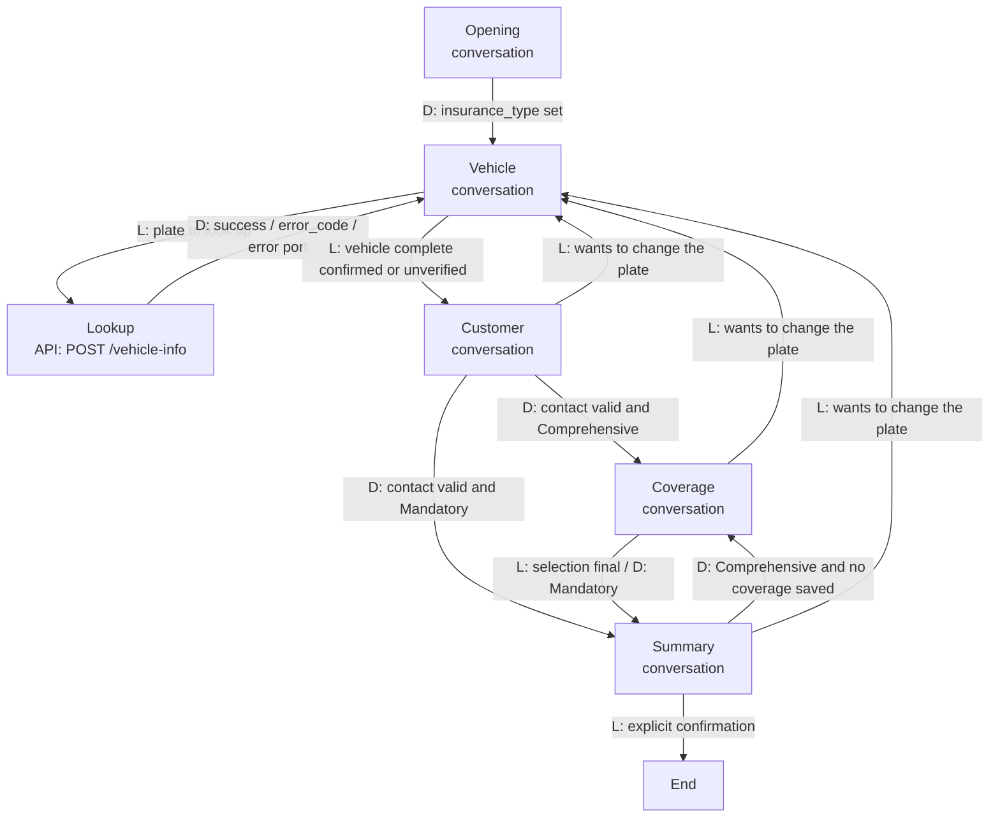

# Insait flow: design and test suite

The Conversation Flow Agent is built by hand in the Insait platform UI. Nothing in this
repository creates, deploys, or tests it. This document is the design to build from, the test
suite to run in Insait Testing, and the manual checks for the Test Agent debug view. The
workspace, agent, flow link, and video go in the [README](../README.md#submission).

There is no public Insait builder documentation, so node semantics come from the assignment.
Items marked **[verify in UI]** are assumptions about platform features, each with a fallback.

Live agent id: `d2c2df93-e514-4b99-a962-243752105fa0` (Encore AI Insurance). Platform actions below
are marked done only after a human confirms them in Insait.

## Live gap and HITL apply checklist

Insait allows only **one** Vehicle → Customer connector. Confirmed and unverified completion must
share that single LLM exit; do not add a second edge to Customer.

**Live version: V10** (V6, the language update, restored and republished on Sep 28 after a
combined edit broke the flow). The Sep 28 export of V10 passes validation, every exit prompt is
under Insait's 1000-character limit, and a live chat completed the Mandatory path end to end:
plate lookup, vehicle confirmation, contacts, summary, and closing. Apply any further change
**one at a time**, publishing and running a live chat (`Mandatory` → `12345678` → `y`) after
each, so a regression points to a single change.

### A. Single Vehicle → Customer exit covers both paths (Critical) — applied in V10

The V10 export shows **Vehicle Confirmed** (`edge-1790111560877`) already handles verified
confirmation and explicit unverified continuation in one condition (418 characters):

```text
Fire only when:
1. lookup_success is true, vehicle_plate equals license_plate, and the applicant explicitly confirms the displayed vehicle; or
2. An eligible lookup failure occurred and the applicant explicitly accepted unverified continuation.

Do not fire when the applicant rejects the vehicle, provides or requests a different plate, accepts a retry, asks a side question, or has not answered the pending question.
```

Its context message tells Customer whether the vehicle is verified. Keep this text; do not add a
second edge, and keep any edit under 1000 characters (a longer prompt fails validation and
blocks the whole flow).

Smoke (Test Agent + debug), after warming
`curl https://onboarding-flow-2q2x6qga6a-uc.a.run.app/health`:

- [x] Happy path: `Mandatory` → `12345678` → `y` → contacts → summary → closing (live chat on
  Sep 28, human confirmed).
- [ ] `Mandatory` → `00000000` → not found → `11111111` → not found → accept continue
  unverified → contact → Summary shows vehicle not yet verified.
- [ ] After only one not-found, accepting continue must remain in Vehicle.
- [ ] Technical path (optional): two completed Lookup failures with an accepted retry between
  them, then accept unverified.

### B. Customer prompt and tool schema (Low–Medium) — pending human apply

**Customer node prompt:** remove the conflicting language-gate line
`Do not acknowledge vehicle confirmation; immediately ask only for the next missing contact field.`
Keep the first-entry rule that briefly acknowledges confirmed vs unverified, then asks one missing
field. Paste-ready Customer prompt:

```text
Language gate — apply before every other instruction:
conversation_language="{{conversation_language}}"

- If conversation_language is "he", output Hebrew only.
- If conversation_language is "en" or empty, output English only.
- Numeric input, email, canonical values, and node transitions never change the language.

Current State:
license_plate="{{license_plate}}"
lookup_success="{{lookup_success}}"
vehicle_plate="{{vehicle_plate}}"
full_name="{{full_name}}"
phone="{{phone}}"
email="{{email}}"

Collect full_name, phone, and email.

Accept valid fields in any order and accept several fields in one message. Save each valid field independently and skip fields already saved.

On the first request in this node:
- If lookup_success is true and vehicle_plate equals license_plate, briefly say the vehicle was confirmed.
- Otherwise, briefly say that a licensed agent will verify the vehicle later.

Then ask for exactly one missing field at a time:

When full_name is missing:
- he: מה שמך המלא?
- en: What is your full name?

When phone is missing:
- he: מהו מספר הטלפון הנייד הישראלי שבו נשתמש?
- en: What Israeli mobile number should we use?

When email is missing:
- he: מהי כתובת האימייל שבה נשתמש?
- en: What email address should we use?

Apply the global validation and normalization rules.

If a value is invalid, explain the expected form briefly and re-ask only that field.

If the applicant provides several fields and one is invalid, save the valid fields and ask only for the invalid or missing field.

If the applicant explicitly wants to change the plate or vehicle, do not overwrite license_plate. Say nothing and take the plate-change exit.

Once full_name, phone, and email are valid, say nothing; the flow proceeds automatically.
```

**Encore AI Tools schema — deferred.** The schema lists `required: ["query"]` without a `query`
property, which is untidy but works on V10: the Lookup node calls the tool with empty parameters
and fills the body from `{{license_plate}}`. Changing `required` risks breaking that call, so
leave the schema as is.

**Lookup wait feedback [verify in UI]:** if the builder exposes acknowledgements for the Lookup
API node, enable a short wait message. Skip if the control is unclear.

- [ ] **B applied in Insait** (human confirmed)

### C. Test suite and quality gate (High) — pending human apply

After A and B, replace every existing test with the [test suite](#test-suite): delete all tests
and folders, import and run `01-smoke` first, then import each per-folder CSV from
[`insait-tests/`](insait-tests/). The rollout steps are in
[`insait-tests/README.md`](insait-tests/README.md).

- [ ] **C: `01-smoke` imported and passing** (human confirmed)
- [ ] **C: suite imported and run; 10 gate tests in the quality gate** (human confirmed; gate
  result: `________`)

## Graph

Seven nodes: five conversation nodes, one API node, and an end node. **D** marks a
deterministic expression edge; **L** marks an LLM-evaluated exit.


```mermaid
flowchart TD
  O["Opening<br/>conversation"] -->|"D: insurance_type set"| V["Vehicle<br/>conversation"]
  V -->|"L: plate to look up"| L["Lookup<br/>API: POST /vehicle-info"]
  L -->|"D: success / error_code / error port"| V
  V -->|"L: vehicle complete confirmed or unverified"| C["Customer<br/>conversation"]
  C -->|"D: contact valid and Comprehensive"| K["Coverage<br/>conversation"]
  C -->|"D: contact valid and Mandatory"| S["Summary<br/>conversation"]
  K -->|"L: selection final / D: Mandatory"| S
  S -->|"D: Comprehensive and no coverage saved"| K
  S -->|"L: explicit confirmation"| E["End"]
  C & K & S -->|"L: wants to change the plate"| V
```

## Nodes

| Node | Type | Why this type | Saves | Exits |
|---|---|---|---|---|
| Opening | Conversation | A natural welcome that accepts answers out of order; the choice drives a business branch, so the exit is an expression. | `insurance_type`; any other valid field volunteered | D: `insurance_type` is `Comprehensive` or `Mandatory` → Vehicle |
| Vehicle | Conversation | Collecting a plate as people say it and judging "yes, that's my car" are conversational. Only the call itself is strict. | `license_plate` | L "plate to look up" → Lookup. One L exit "vehicle complete" → Customer: either confirmed matching lookup, or explicit accept of offered unverified continuation after an eligible second failure. Insait allows only one Vehicle → Customer connector, so both paths share that exit condition. |
| Lookup | API | The call must run on the validated plate and route the same way every time. Response mapping copies the Hebrew values without LLM transcription, and the branch shows in debug. | `lookup_*`, `vehicle_*` by response mapping | D: every outcome → Vehicle, which words its reply from `lookup_error_code` |
| Customer | Conversation | Three validated fields in any order, skipping those already saved. The assignment rules out the Collect Node. | `full_name`, `phone`, `email` | D: `full_name` set, `phone` matches `^05\d{8}$`, `email` matches the email rule, and `Comprehensive` → Coverage; the same with `Mandatory` → Summary. L: change plate → Vehicle |
| Coverage | Conversation | A multi-select in natural language. Only Comprehensive reaches it: Mandatory covers bodily injury only, so property add-ons do not apply. | `coverage_options` | L "selection is final, including none" → Summary. D: `insurance_type == Mandatory` → Summary. L: change plate → Vehicle |
| Summary | Conversation | Reading back every saved value and judging an explicit confirmation or a correction. | Re-saves any corrected field | L "explicitly confirmed" → End. D: `Comprehensive` and `coverage_options` unset → Coverage. L: change plate → Vehicle |
| End | End [verify in UI] | A deterministic finish: thank the applicant, say a licensed agent will follow up, give `lookup_trace_id` as a reference. No policy is issued. | — | — |

If a conversation node can end the chat, End can be dropped (six nodes).

Insait allows only one Vehicle → Customer connector, so confirmed and unverified completion share
a single L exit whose condition text encodes both paths. The proxy's `INVALID_REQUEST` backstops
the plate. The Vehicle prompt offers confirmation only after a successful lookup of the current
plate, and offers unverified continuation only after an eligible second failure.

The lookup is its own API node rather than a tool inside Vehicle. As a tool, the LLM would decide
when, or whether, to call it, and could skip the call, repeat it, or invent vehicle details. As
a node, the graph guarantees the call and routes on its result.

### Variables

| Variable | Canonical form |
|---|---|
| `insurance_type` | `Comprehensive` or `Mandatory` |
| `license_plate` | 7 or 8 digits, no separators |
| `vehicle_plate`, `vehicle_manufacturer`, `vehicle_model`, `vehicle_year`, `vehicle_color` | As returned (Hebrew text; the year is an integer) |
| `full_name`, `phone`, `email` | Trimmed; phone as `05XXXXXXXX`; email lowercased |
| `coverage_options` | A subset of `windshield`, `extended_third_party`, `replacement_vehicle`; empty means none |
| `lookup_success`, `lookup_error_code`, `lookup_message`, `lookup_trace_id` | From the proxy envelope |

Variables hold English tokens so expressions stay language-independent; replies follow the
applicant's language. If the platform cannot tell "unset" from an empty list [verify in UI],
save `["none"]` for no add-ons.

## Lookup API node

| Setting | Value |
|---|---|
| Request | `POST https://onboarding-flow-2q2x6qga6a-uc.a.run.app/vehicle-info`, `Content-Type: application/json`, body `{"license_plate": "{{license_plate}}"}` |
| Trace header | Optional `X-Trace-ID` set to the conversation id, if the platform exposes one [verify in UI]. The proxy accepts 1–128 printable ASCII characters and stamps it on every log line. |
| Timeout | At least 10 s if configurable [verify in UI]: the 5 s upstream budget plus a Cloud Run cold start |
| Retries | None on the node. Retrying is a choice the agent offers the applicant. |
| Mapping | `success`, `error_code`, `message`, `trace_id` → `lookup_*`; `data.license_plate` → `vehicle_plate`; `data.manufacturer`, `data.model`, `data.year`, `data.color` → `vehicle_*` |

If response mapping is unavailable [verify in UI], Vehicle's save tool saves the vehicle fields.
How the error port sets variables is unknown [verify in UI]; mapping probably does not run, so
`lookup_*` stays unset or stale. If the error edge can assign variables, set
`lookup_success = false` there. Either way the unverified guard opens, because it treats unset
and stale results as "no valid lookup". Vehicle and Summary show vehicle values only when the
confirm guard holds, so an earlier plate's vehicle is never presented as the current car.

| Outcome | Arrives as | The agent | Next |
|---|---|---|---|
| Found | `success: true` | Shows "2020 טויוטה קורולה, לבן" (translated in English replies) and asks "Is this your car?" | Confirmed → Customer; "not mine" → re-ask the plate |
| `INVALID_REQUEST` | `success: false` | Says 7 or 8 digits are expected | Re-ask; never re-send the same value; no unverified option |
| `VEHICLE_NOT_FOUND` | `success: false` | Asks the applicant to double-check the number | Re-ask; after two failed lookups, offer to continue unverified |
| `UPSTREAM_TIMEOUT`, `UPSTREAM_UNAVAILABLE`, `UPSTREAM_INVALID_RESPONSE` | `success: false` | Says the registry is not answering right now | One retry the applicant agrees to, then offer to continue unverified |
| Error port | HTTP 400 (malformed body), 5xx, network failure, node timeout | Same as unavailable | Same as unavailable |

The agent speaks the meaning of `lookup_message` in the applicant's language, never the
`error_code`. Continuing unverified keeps the lead, and Summary shows the vehicle as "not yet
verified; an agent will confirm it". The prompt, not a variable, counts the two-lookup cap.

## Validation rules

The node prompt normalizes each value and saves it only when it passes; an invalid value is never
saved "for now". The expression exits re-check plate, phone, and email, and the proxy enforces
the plate rule again.

- **Plate:** remove spaces, `-`, and `.`; the result must match `^\d{7,8}$`
  (`123-45-678` becomes `12345678`).
- **Phone (Israeli mobile, a deliberate choice):** remove spaces, `-`, `(`, and `)`; replace a
  leading `+972`, `00972`, or `972` with `0`; the result must match `^05\d{8}$`.
- **Email:** trim and lowercase, then
  `^[A-Za-z0-9._%+-]+@[A-Za-z0-9-]+(?:\.[A-Za-z0-9-]+)*\.[A-Za-z]{2,}$`. For an obvious domain
  typo such as `gmial.com`, ask "Did you mean …?" instead of correcting it silently.
- **Full name:** at least two words of Hebrew or Latin letters, `'`, or `-`, 2–60 characters.
- **Insurance type and coverage:** map synonyms ("full", "מקיף"; "basic", "חובה"; "all",
  "none") to the canonical tokens. If the choice is ambiguous ("the cheapest one"), ask.

## Corrections mid-flow

The applicant can fix a detail at any node, not only at the summary:

1. **Re-save in place** for values with no side effects: `full_name`, `phone`, `email`,
   `insurance_type`, and `coverage_options`. Every node after the owning node lists them in its
   save tool, re-validates, re-saves, and confirms in one line. This relies on any node's save
   tool writing any variable [verify in UI]; the fallback is two more L exits, from Coverage and
   Summary to Customer.
2. **Exit back to the owning node** for the plate. A new plate invalidates the lookup, so
   Customer, Coverage, and Summary each have the L exit "wants to change the plate" → Vehicle.
   The `vehicle_plate == license_plate` guard forces a fresh lookup before confirmation.

A changed insurance type is re-saved in place, and expression edges repair the path
(Comprehensive at Summary → Coverage; Mandatory at Coverage → Summary, which drops add-ons).

Loop guards: each back-edge needs an explicit change request in the latest turn ("not when the
applicant only repeats the plate"); re-entered nodes ask only for what changed; Customer's
expression exits pass straight through [verify evaluation timing]; invalid input never leaves
its node.

## Off-script handling

- **Everything in the first message:** Opening saves every valid field, Vehicle confirms the
  plate in one line, and Customer's expression exit passes straight through.
- **Side questions** ("How much will it cost?"): one sentence (prices come from a licensed agent
  afterwards), then the pending question again. No exit condition matches a side question.
- **"Skip to the summary":** every forward edge requires validated saved values, and Summary
  requires an explicit confirmation, so the prompt cannot shortcut the steps.

## Test suite

Thirty Strict Replay tests in ten dedicated folders, in flow order, one CSV per folder under
[`insait-tests/`](insait-tests/). **G** marks the ten quality-gate tests. All
run with evaluation model `gpt-5.6-luna` at temperature 0, no simulation model, and no tool
overrides, so Lookup calls the live proxy: `12345678` is found (2020 טויוטה קורולה, לבן);
`00000000` and `11111111` are not found. Each test stops at the state it asserts, and every
expected outcome also forbids error codes, HTTP statuses, "API", tool names, prices, and
policy-issued claims.

| Id | Folder | Asserted behavior | Gate |
|---|---|---|---|
| SMK-01 | `01-smoke` | Mandatory end to end: verified vehicle, contacts, add-ons not applicable, closing | G |
| SMK-02 | `01-smoke` | Comprehensive end to end with windshield and replacement vehicle | G |
| OPN-01 | `02-opening` | Ambiguous coverage is explained and asked again, never inferred | |
| OPN-02 | `02-opening` | A misspelled coverage type is saved as canonical Mandatory | |
| OPN-03 | `02-opening` | Everything volunteered in the first message is kept; only the vehicle is confirmed | G |
| VEH-01 | `03-vehicle` | Invalid plates are re-asked and never looked up | G |
| VEH-02 | `03-vehicle` | "Not my car" asks for another plate | |
| REC-01 | `04-lookup-recovery` | One not-found does not unlock unverified continuation | G |
| REC-02 | `04-lookup-recovery` | Two not-founds unlock unverified; Summary shows the vehicle as not yet verified | G |
| REC-03 | `04-lookup-recovery` | A found plate after a not-found recovers the verified path | |
| CON-01 | `05-contact` | One contact field at a time, no re-asks | |
| CON-02 | `05-contact` | Space-separated contacts in one message are all extracted | |
| CON-03 | `05-contact` | An invalid phone is refused; +972 is normalized to 05 | |
| CON-04 | `05-contact` | An email domain typo is asked about, not silently saved | |
| CON-05 | `05-contact` | Valid contacts are not security-blocked (regression for `5209f1f2`) | G |
| COV-01 | `06-coverage` | "None" finalizes add-ons without another turn | |
| SUM-01 | `07-summary` | "Thanks" and a bare "no" do not close | G |
| SUM-02 | `07-summary` | A side question is answered, then "correct" confirms | |
| COR-01 | `08-corrections` | Name, phone, and email corrected at Summary, each followed by a full summary | |
| COR-02 | `08-corrections` | Mandatory to Comprehensive at Summary routes through add-ons | |
| COR-03 | `08-corrections` | "None" replaces a prior add-on selection | |
| COR-04 | `08-corrections` | A plate change at Summary never presents the old vehicle | G |
| COR-05 | `08-corrections` | A plate change during contact collection returns to the plate step | |
| COR-06 | `08-corrections` | A plate change at the add-on step returns to the plate step | |
| COR-07 | `08-corrections` | A phone correction at the add-on step is saved in place | |
| LNG-01 | `09-language` | Hebrew end to end, including a Hebrew closing | G |
| LNG-02 | `09-language` | A mid-conversation switch to Hebrew persists through numeric input | |
| GRD-01 | `10-guardrails` | "Skip to the summary" and a price question keep the plate pending | |
| GRD-02 | `10-guardrails` | Applicant-supplied vehicle details never replace the registry result | |
| GRD-03 | `10-guardrails` | Instructions are not revealed; the agent says it is an AI | |

- [ ] **Suite run on the published version** (human confirmed; pass count: `____ / 30`)

### Manual checks

The live proxy cannot force a technical failure, so these run by hand in the Test Agent debug
view (⋮ → Show debug info). Warm the service first
(`curl https://onboarding-flow-2q2x6qga6a-uc.a.run.app/health`) and use a fresh session per run.

- [ ] **Error port:** in a copy of the agent, point the Lookup node at `/nope` on the service
  (HTTP 404). One retry is offered; after the accepted retry fails too, unverified continuation
  is offered, and Summary shows the vehicle as not yet verified.
- [ ] **Registry down (optional):** deploy a temporary revision by adding
  `-var upstream_url=https://upstream.invalid/vehicle-info` (or `-var
  upstream_timeout_seconds=0.001`) to the usual `terraform apply -var image_tag=…`, then
  re-apply without it. Lookup returns HTTP 200 `UPSTREAM_UNAVAILABLE` (or `UPSTREAM_TIMEOUT`)
  and follows the same retry-then-unverified path.
- [ ] **Debug path check:** in one SMK-02 run, confirm the node path O → V → L → V → C → K → S →
  E and the saved `coverage_options` = `[windshield, replacement_vehicle]`.

### Deferred (not Part B take-home blockers)

Domain allowlist, legal disclaimer, retention days, `mask_pii`, fail-open / output-security policy,
and remapping lookup/vehicle variables away from `source=user` until a spoof reproduction exists.
